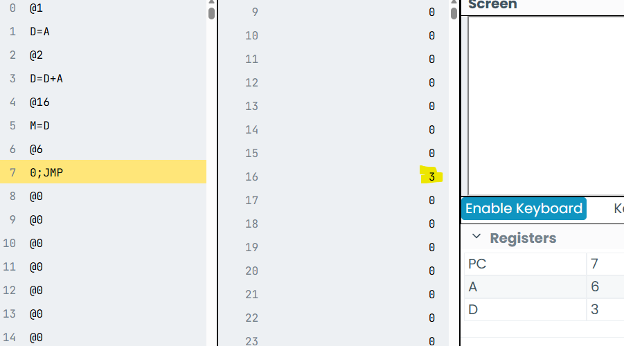

<h1>Actividad1</h1>

Se realizaron los ejericios de Fetch-Decore-Execute

- uno
- dos
- tres

<h1>Actividad 2</h1>

- <h3>¿Qué sucede?</h3>
El valor almacenado en la variable 16 cambia de 0 a 3

- <h3>¿Qué valor se almacena en la dirección de memoria 16?</h3>
El valor 3

- <h3>¿Por qué crees que es ese valor?</h3>
Porque en el código primero se almacena el valor 1 en A para guardarlo en D, luego se guarda el número 2 en A y se realiza una suma con el valor ya guardado previamente en D con el nuevo valor de A y se actuliza el valor de D con el resultado de esta suma.

- <h3>¿Qué instrucciones se ejecutan en cada ciclo Fetch-Decode-Execute?</h3>
Se ejecutan todas las instrucciones de cada ciclo, el resultado final (3 en el valor 16) es la muestra de que que primero hubo un fetch, para buscar y almacenar los datos, un decode para que estos datos se puedan leer para comprender que hacer y finalmente el execute el realizar la suma y mostrar el resultado

- <h3>¿Qué cambios observas en el contenido de la memoria y los registros?</h3>
En la memoria solo se muestra el resultado de la suma en el valor 16, y en los registros se logra visualizar la actualización de los valores al leer cada línea y finalmente se logra ver con que valores queda el PC, A y D.

