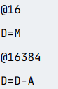

<h2>Actividad 3</h3>
<ul>
  <li>Identifica una instrucción que use la ALU y explica qué hace.
    
Esta asignando a D el nuevo valor obtenido de la resta, la en D y A, el cual es 0, POR ene esta reiniciando los valores del programa a 0. 

  </li>
  <li>¿Para qué sirve el registro PC?
    
Para almacenar la direccion de la memoria de la siguiente instruccion a ejecutar.

  </li>
  <li>¿Cuál es la diferencia entre @i y @READKEYBOARD?
    
@READKEYBOARD es una etiqueta quelmacena el valor de la última tecla presionada mientas que @i es una variable utilizada para gestionar lógica interna.

  </li>
  <li>Describe qué se necesita para leer el teclado y mostrar información en la pantalla.
    
La dirección KBD permite leer el estado del teclado; cuando su valor es cero significa que no hay ninguna tecla presionada y cuando es diferente de cero indica que sí        hay una tecla presionada. Para mostrar información en la pantalla se usa la dirección SCREEN, que corresponde al inicio de la memoria de video. Al escribir valores          en las posiciones de memoria a partir de SCREEN, se encienden o apagan píxeles en la pantalla. Además, se usan registros como D y una variable (i) para manejar               comparaciones, recorrer la pantalla y controlar el flujo del programa mediante saltos condicionales.

  </li>
  <li>Identifica un bucle en el programa y explica su funcionamiento.
  
El bucle principal del programa inicia en la etiqueta READKEYBOARD. Este bucle se repite constantemente porque al final del código se realiza un salto incondicional de regreso a esa etiqueta. En cada repetición, el programa revisa el valor del teclado, decide si hay una tecla presionada y, según el resultado, borra o llena la pantalla. Este bucle infinito permite que el programa esté siempre atento a la entrada del teclado y responda de manera continua.

  </li>
  <li>Identifica una condición en el programa y explica su funcionamiento.
  
Una condición del programa es la que verifica si una tecla está presionada. Esto se hace leyendo el valor almacenado en KBD y comparándolo con cero. Si el valor es diferente de cero, el programa salta a la etiqueta KEYPRESSED, lo que indica que hay una tecla presionada y se ejecuta el código para modificar la pantalla. Si el valor es cero, el programa continúa con la rutina que borra la pantalla.

  </li>
</ul>

