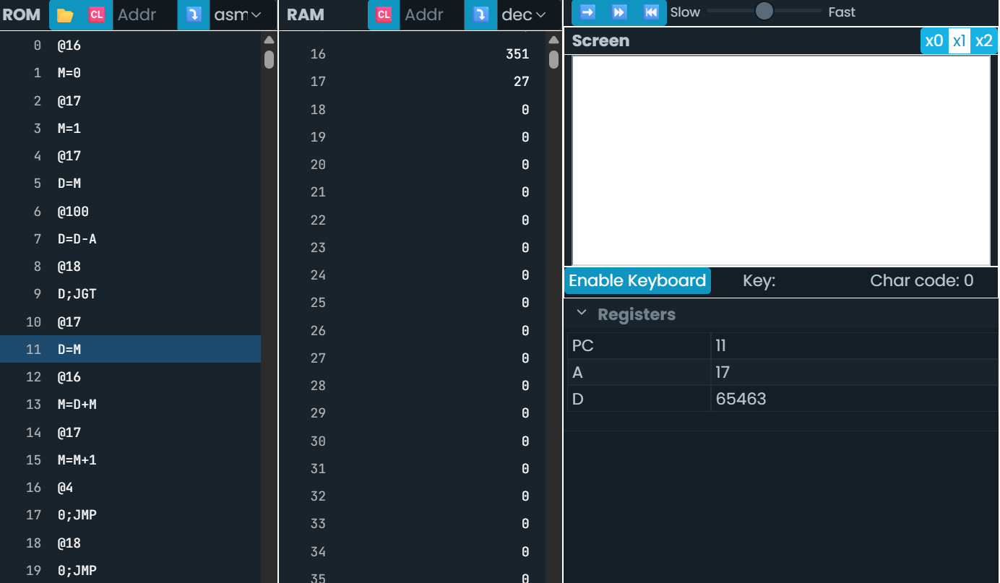
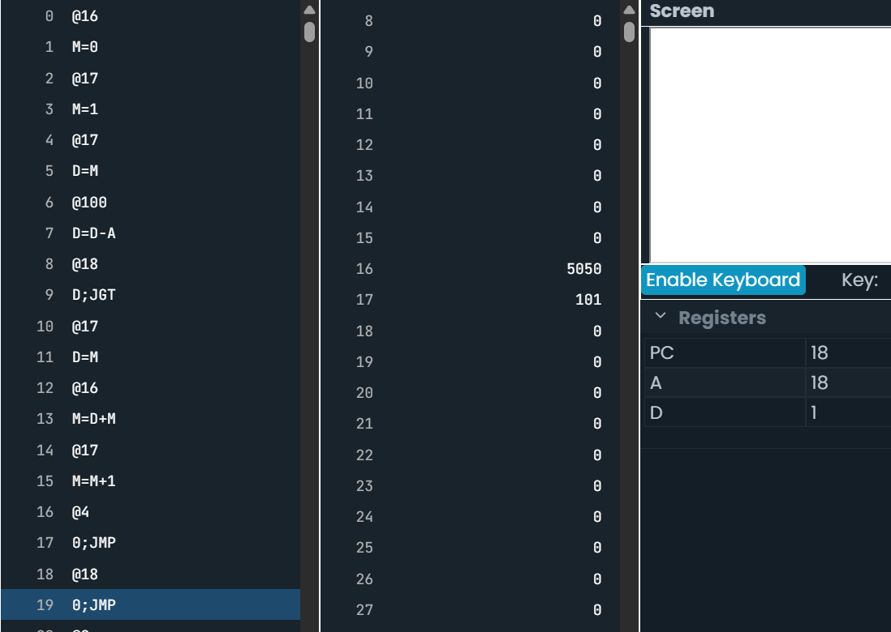

# Actividad 4

- Ciclo for

```.c++

int sum=0;

for(int i = 1; i <=100; i++){
sum+= i;
}
```

Probando el ciclo con el código


Eso significa: si i - 100 > 0 → termina.
Es decir, cuando i > 100, sale del ciclo. Exactamente lo que hace i <= 100.



## Conclusión

Ambas versiones son prácticamente idénticas (en ensamblador).

Solo cambia el orden de inicialización (sum e i), pero la estructura del ciclo es la misma:

Evaluar condición, saltar si se cumple la condición de salida, ejecutar cuerpo, incrementar, volver al inicio
