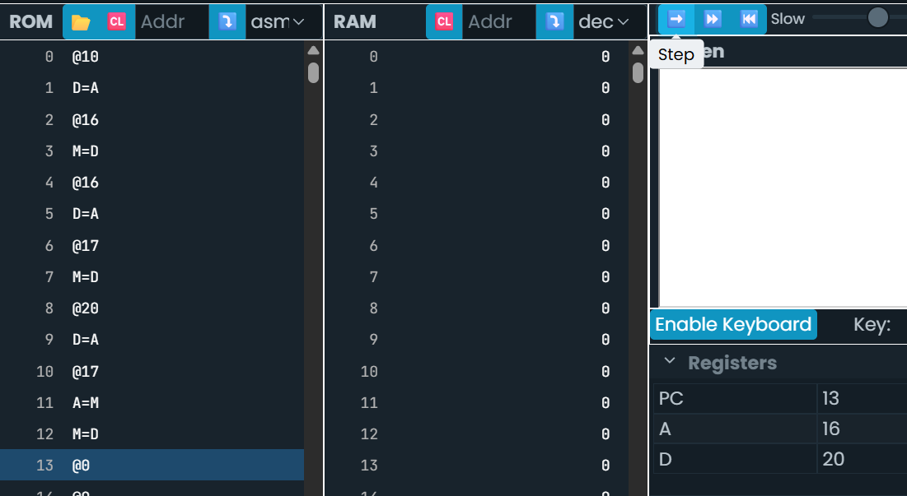

# Actividad 5

## Programa 1

- Código en c++

````.c++
int a = 10; 
int*p; 
p = &a; 
*p = 20;
````



### Estado inicial

````.asm
RAM[16]=a
RAM[17]=p
````

1. a = 10

````.asm
RAM[a] = 10
````

2. p = &a

````.asm
RAM[p] = dirección de a (ej: 16)
````

3. *p = 20

````.asm
A = RAM[p] → 16
RAM[16] = 20
````

4. Resultado final

````.asm
a = 20
p = dirección de a
````

Aquí se confirma que el puntero no guarda el valor, guarda la dirección.
Cuando usamos A=M, estamos diciendo: "ve a la dirección almacenada en p  ".

## Programa 2

- Código en c++

````.c++
int a = 10; 
int b = 5; 
int *p; 
p = &a; 
b =*p;
````

````.asm
// a = 10
@10
D=A
@a
M=D

// b = 5
@5
D=A
@b
M=D

// p = &a
@a
D=A
@p
M=D

// b = *p
@p
A=M     // A = dirección almacenada en p
D=M     // D = *p
@b
M=D     // b = D
````


Simulación paso a paso
Estado inicial

````.asm
RAM[16]=a
RAM[17]=b
RAM[18]=p
````

1. a = 10

````.asm
RAM[a] = 10
````

2️. b = 5

````.asm
RAM[b] = 5
````

3️. p = &a

````.asm
RAM[p] = dirección de a
````

4️. b = *p

````.asm
A = RAM[p]
D = RAM[A] → 10
RAM[b] = 10
````

- Resultado final

a = 10 \
b = 10 \
p = dirección de a

Un "puntero" es simplemente una variable que guarda una dirección.

@p + A=M permite acceder indirectamente.

No existe tipado, solo direcciones y valores.
