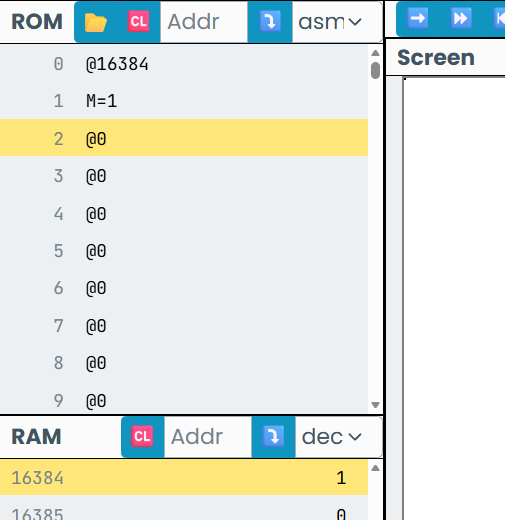
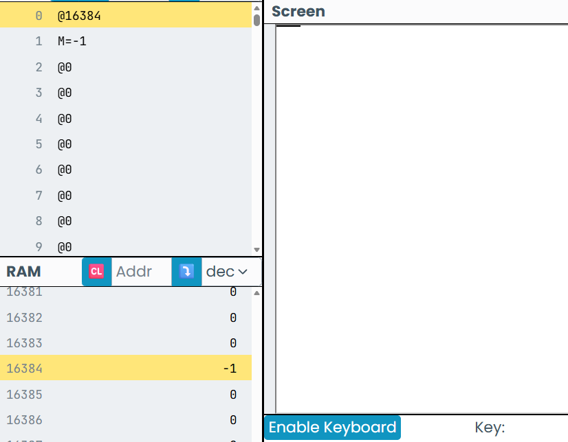
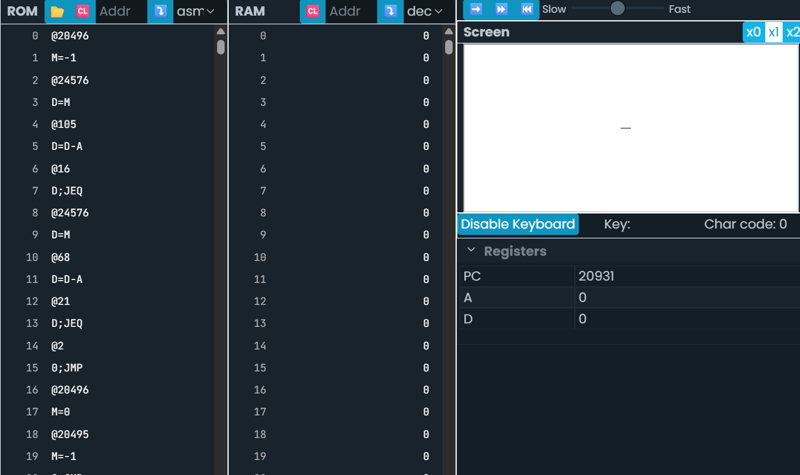
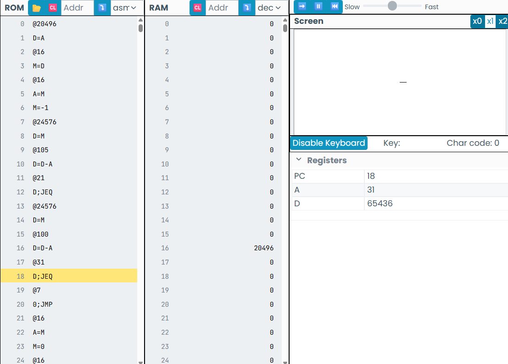

# Actividad 1

- Punto en el screen



## Actividad 2

- Línea horizontal de 16 px



## Actividad 3

- Primero de debe calcular en X el registro que quede en la mitad: 16384+(128\*32)+16.

RAM[20496] = -1 \
Leer KBD \
si KBD = 105 \
 izquierda \
si no \
si KBD = 68 \
 derecha \
si no \
ir a KBD

izquierda \
RAM [20496] = 0 \
RAM [20495] = -1

derecha \
RAM [20495] = -1 \
RAM [20496] = 0

- Asi se Visualiza en código asembly (Se utilizó IA para saber en dóde penr las etiquetas y saber como funcionan)



El código no funciona, la línea se mueve a la izquierda al oprimir la tecla "i" pero se hace mas chica al oprimir la "d".
Estos no fucnionaba porque el loop retornaba al inici, reiniciando el ciclo desde 0.

- Código funcional. (Se mueve de lado a lado)


- Ahora el codigo se tiene que mover n° veces al oprimir "d" e "i" (funciona)



```.asm
//Asigno el valor 20496 al puntero
@20496
D=A
@PUNTERO
M=D
//Pinto el puntero
@PUNTERO
A=M
M=-1

(KBD_LOOP)
@KBD
D=M
@105
D=D-A
@IZQUIERDA
D;JEQ
@KBD
D=M
@100
D=D-A
@DERECHA
D;JEQ
@KBD_LOOP
0;JMP


(IZQUIERDA)
@PUNTERO
A=M
M=0
@PUNTERO
M=M-1
@PUNTERO
A=M
M=-1
@KBD_LOOP
0;JMP


(DERECHA)
@PUNTERO
A=M
M=0
@PUNTERO
M=M+1
@PUNTERO
A=M
M=-1
@KBD_LOOP
0;JMP
```


