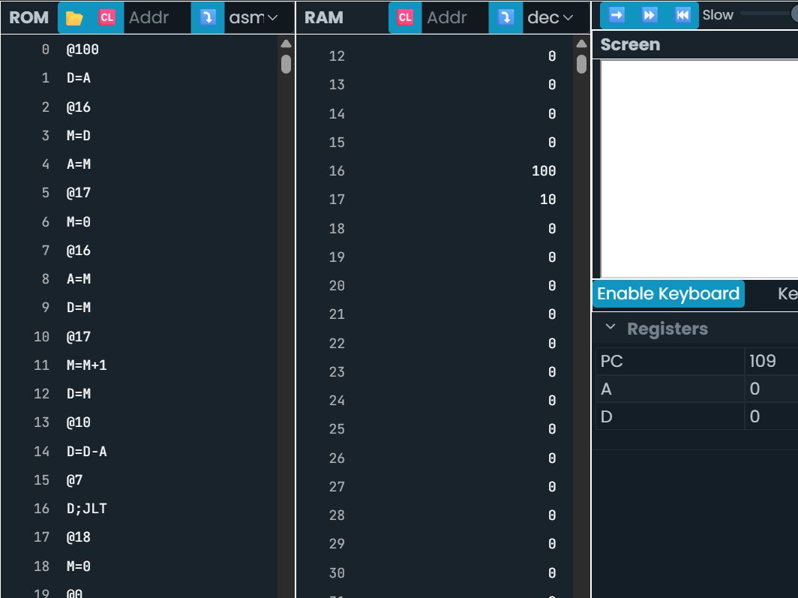

# Actividad 6

- Código en c++

```.c++
int arr[] = {11,233,23,77,112,61,67,98,900,810};
int sum = 0;
for (int j = 0; j < 10; j++) {
sum = sum + arr[j];
}
```

1. Realizo el loop para contar de 1 a 10

```.asm
@100
D=A
@ARRAY
M=D
A=M

@CONTADOR
//Declaro e inicializo el contador en 0
M=0
// Inicio el LOOP y le sumo 1 en cada vuelta
(LOOP)
@ARRAY
A=M
D=M
//SUM = SUM + D
@CONTADOR
M=M+1
D=M
@10
D=D-A
@LOOP
D;JLT

@SUM
M=0
```



Este código va fallando porque:

- No recorre realmente las posiciones ARRAY + j.
- No se esta acumulando en SUM.

Para arreglar paso por paso:

- Inicializo variables

```.asm
@0
D=A
@CONTADOR
// j = 0
M=D

@SUM
// sum = 0
M=0
```

- Condición: j < 10

```.asm
@CONTADOR
D=M
@10
D=D-A
@END
D;JGE
```

Equivale a:

```.c++
if (j >= 10) break;
```

- Para acceder al arr (Aquí solicite ayuda de la IA )

``` .asm
@ARRAY
D=M          // D = base del arreglo

@CONTADOR
A=D+M        // A = base + j

D=M          // D = arr[j]
````
