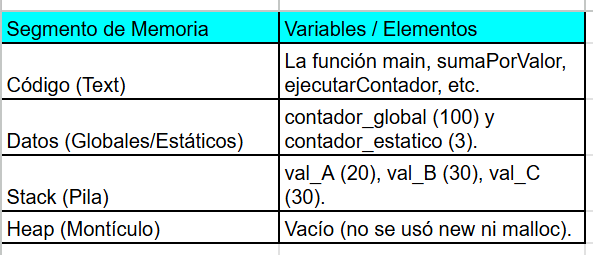
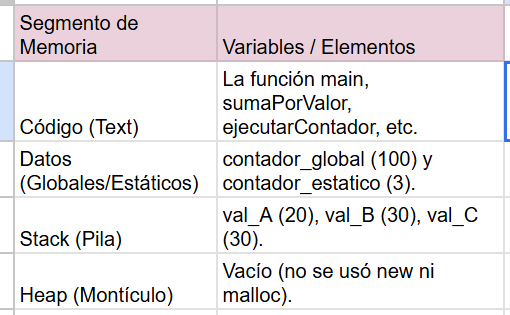

## Actividad Integradora

```.c++
#include <iostream>
int contador_global = 100;
void ejecutarContador() {
		static int contador_estatico = 0;
		contador_estatico++;
		std::cout << "  -> Llamada a ejecutarContador. Valor de contador_estatico: " << contador_estatico << std::endl;
}

void sumaPorValor(int a) {
		a = a + 10;
		std::cout << "  -> Dentro de sumaPorValor, 'a' ahora es: " << a << std::endl;
}
void sumaPorReferencia(int& a) {
		a = a + 10;    std::cout << "  -> Dentro de sumaPorReferencia, 'a' ahora es: " << a << std::endl;
}
void sumaPorPuntero(int* a) {
		*a = *a + 10;
		std::cout << "  -> Dentro de sumaPorPuntero, '*a' ahora es: " << *a << std::endl;
}
int main() {
		int val_A = 20;
		int val_B = 20;
		int val_C = 20;
    std::cout << "--- Experimento con paso de parámetros ---" << std::endl;
    std::cout << "Valor inicial de val_A: " << val_A << std::endl;
    sumaPorValor(val_A);
    std::cout << "Valor final de val_A: " << val_A << std::endl << std::endl;
    std::cout << "Valor inicial de val_B: " << val_B << std::endl;
    sumaPorReferencia(val_B);
    std::cout << "Valor final de val_B: " << val_B << std::endl << std::endl;
    std::cout << "Valor inicial de val_C: " << val_C << std::endl;
    sumaPorPuntero(&val_C);
    std::cout << "Valor final de val_C: " << val_C << std::endl << std::endl;
    std::cout << "--- Experimento con variables estáticas ---" << std::endl;
    ejecutarContador();
    ejecutarContador();
    ejecutarContador();
    return 0;
}
```

## A. Predicción (sin ejecutar el código):

1. ¿Cuál será la salida final en la consola de este programa?
   --- Experimento con paso de parámetros ---
   Valor inicial de val_A: 20
   -> Dentro de sumaPorValor, 'a' ahora es: 30
   Valor final de val_A: 20

   Valor inicial de val_B: 20
   -> Dentro de sumaPorReferencia, 'a' ahora es: 30
   Valor final de val_B: 30

Valor inicial de val_C: 20
-> Dentro de sumaPorPuntero, '\*a' ahora es: 30
Valor final de val_C: 30

--- Experimento con variables estáticas ---
-> Llamada a ejecutarContador. Valor de contador_estatico: 1
-> Llamada a ejecutarContador. Valor de contador_estatico: 2
-> Llamada a ejecutarContador. Valor de contador_estatico: 3 2. Escribe la salida completa que esperas.



3. Dibuja un mapa de memoria conceptual de este programa justo antes de que main finalice. Debes indicar en qué segmento de memoria (Stack, Heap, Datos Globales/Estáticos, Código) se encontraría cada una de las siguientes variables: contador_global, contador_estatico, val_A, val_B, val_C (dentro de main), el parámetro a de la función sumaPorValor, la función main misma.



## B. Verificación y análisis (usando el depurador):

Ejecuta el programa paso a paso (F10) con un breakpoint al inicio de main.

1. Compara la salida real con tu predicción. Si hubo diferencias, explica por qué ocurrieron. Evidencia clave: capturas de pantalla antes y después de los puntos de interés (¿Cuáles son esos puntos? -> tu tarea analizarlo).

Al seguir los pasos de F10 y F11, se nota que la predicción coincide con la realidad. Los puntos críticos para capturar evidencia son:

Punto de Interés 1 (Paso por Valor): Al entrar en sumaPorValor, el depurador muestra que a tiene una dirección de memoria distinta a val_A. Por eso, al modificar a, val_A en main permanece intacto.

Punto de Interés 2 (Paso por Referencia/Puntero): Al entrar en estas funciones, verás que la dirección de memoria de a (o el valor del puntero) coincide exactamente con la dirección de val_B o val_C. Son el mismo dato.

2. Describe qué demuestran estas capturas sobre la diferencia entre los diferentes tipos de paso por parámetros analizados.

- Valor: Crea una copia local. Es seguro porque no altera el original, pero consume más memoria si el objeto es grande.

- Referencia: Crea un alias. Es eficiente (no copia) y permite modificar el original con una sintaxis limpia.

- Puntero: Pasa la dirección de memoria. Es la forma explícita de decir "estoy trabajando con el original" y permite manejar valores nulos (nullptr), algo que la referencia no permite.

3. Explica con tus propias palabras el comportamiento de contador_estatico. ¿Por qué “recuerda” su valor entre llamadas a la función ejecutarContador? ¿En qué se diferencia de una variable local normal?

A diferencia de una variable local normal que vive en el Stack (y se borra cuando la función termina), contador_estatico se almacena en el segmento de Datos Estáticos.

Diferencias clave:

Variable Local: Tiene "almacenamiento automático". Se crea y se destruye en cada llamada. Si contador_estatico fuera local, siempre imprimiría "1".

Variable Estática: Se inicializa una sola vez al principio del programa. Su tiempo de vida es igual al del programa completo, pero su "alcance" es privado: solo la función ejecutarContador puede verla y modificarla, aunque la variable siga existiendo físicamente en la sección de datos globales.
