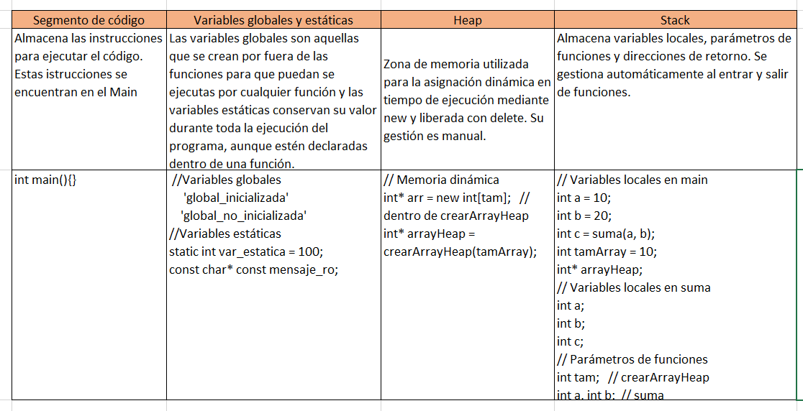

## Actividad 3

Revisa de nuevo el programa anterior y construye tu propio mapa de memoria indicando en qué parte del mapa se ubican las variables y constantes globales, locales, estáticas y de la memoria dinámica y en qué parte del mapa se encuentran las funciones y el mensaje de solo lectura.

