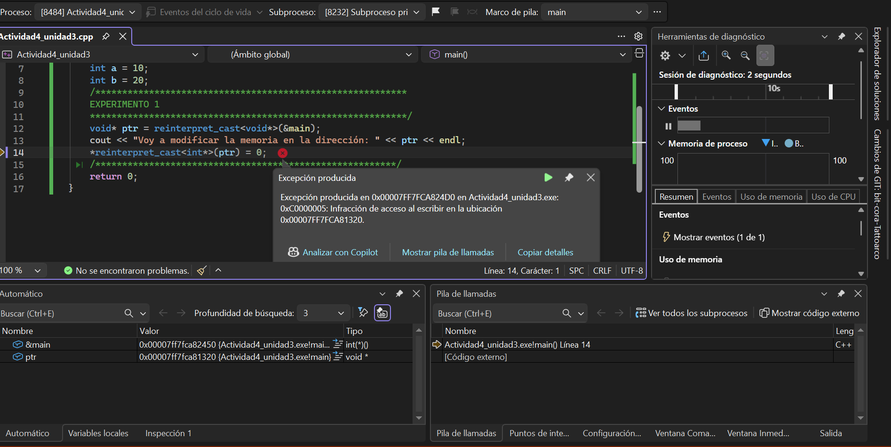
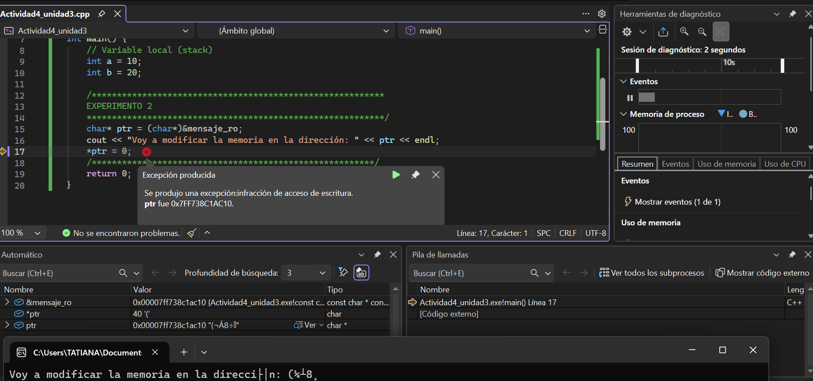
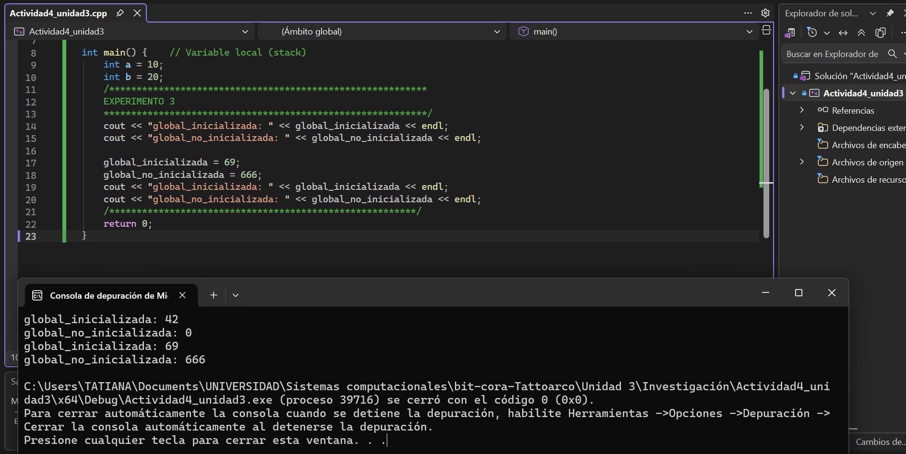
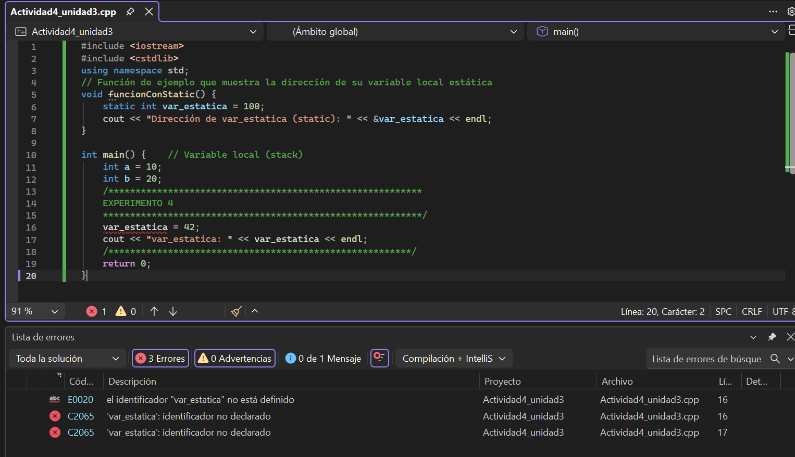
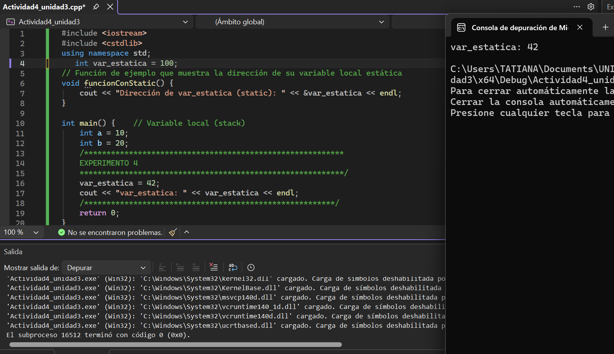

## Actividad 4

### Experimento 1: Modificar el segmento de texto

- ¿Qué ocurre?

El programa normalmente:

1. Se cierra solo.
2. Da error y se comporta de manera extraña.

- ¿Por qué?

Porque se esta intentando modificar el código del programa (main).

El segmento de código es de solo lectura, el sistema operativo lo protege para evitar que el programa se modifique a sí mismo y no se puede escribir en esa área de memoria.

Intentar cambiarlo genera un error de acceso a memoria.



### Experimento 2: Modificar una constante global

- ¿Qué ocurre?

El programa normalmente:

Se bloquea o da un error de memoria.

- ¿Por qué?

El mensaje:

```.c++
const char* const mensaje_ro = "Hola, memoria de solo lectura";
```

Está guardado en una zona de solo lectura.
Aunque hagasse haga un cast para quitar el const, la memoria sigue protegida.
No se pueden modificar los literales de texto.



### Experimento 3: Modificar una variable global

- ¿Qué ocurre?

El programa funciona correctamente, los valores cambian sin problema.

Ejemplo de salida:

```.c++
global_inicializada: 42
global_no_inicializada: 0
global_inicializada: 69
global_no_inicializada: 666
```

- ¿Por qué?

Las variables globales están en el segmento de datos.

Ese segmento:Sí permite modificaciones, por eso el programa funciona correctamente y los valores cambian sin problema.



### Experimento 4: Modificar variable estática fuera de la función

- ¿Qué ocurre?

El programa no compila.

```.c++
Error:
var_estatica no está declarada
```

- ¿Por qué?

La variable estática está dentro de la función:

```.c++
static int var_estatica = 100;
```

Eso significa que var_estatica solo es visible dentro de esa función, no se puede acceder a ella desde fuera. Intentar modificarla desde fuera genera un error de compilación porque no se encuentra la variable.

- ¿Qué pasa con las variables normales al entrar y salir de una función?

Se crean al entrar, se destruyen al salir y pierden su valor.

- ¿Qué pasa con las variables estáticas?

Se crean una sola vez, no se destruyen al salir, conservan su valor entre llamadas.





### Experimento 5: Variable estática vs no estática

- ¿Qué ocurre?

En cada iteración var_no_estatica siempre vale 100, var_estatica aumenta cada vez.

- ¿Por qué?

var_no_estatica está en el stack, se crea cada vez y siempre empieza en 100.

var_estatica se crea una sola vez, guarda su valor y está en el segmento de datos.

### Experimento 6: Modificar memoria del Heap después de delete

- ¿Qué ocurre?

Puede pasar cualquiera de estas cosas:

1. Imprime basura.
2. Imprime el valor anterior.
3. El programa se bloquea.

- ¿Por qué?

Porque haces esto:

```.c++
delete[] arrayHeap;
cout << arrayHeap[0] << endl;
```

Después de delete, la memoria ya no es válida.

- Diferencias entre Heap y Stack

<table>
  <tr>
    <th>Heap</th>
    <th>Stack</th>
  </tr>
  <tr>
    <td>Manual</td>
    <td>Automático</td>
  </tr>
  <tr>
    <td>Se libera con delete</td>
    <td>Se libera solo</td>
  </tr>
  <tr>
    <td>Más flexible</td>
    <td>Más rápido</td>
  </tr>
  <tr>
    <td>Más lento de acceder</td>
    <td>Más rápido de acceder</td>
  </tr>
</table >

- ¿Qué consecuencias tendría no liberar la memoria reservada con new?

Si no liberas la memoria con delete, se produce una fuga de memoria. Esto significa que la memoria asignada permanece ocupada y no puede ser reutilizada por el sistema operativo, lo que puede llevar a un consumo excesivo de memoria y eventualmente a que el programa o el sistema se queden sin memoria disponible.

- ¿Por qué es importante usar delete[] al liberar memoria asignada para un arreglo?

Porque delete[] sabe que se trata de un arreglo y libera toda la memoria asignada correctamente. Si usas delete sin los corchetes, solo se liberará la primera posición del arreglo, lo que puede causar fugas de memoria y comportamiento indefinido.
