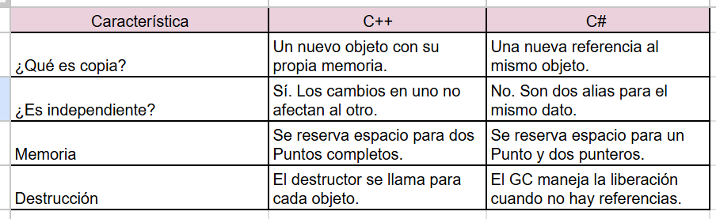

##Actividad 5: Copia de objetos en C++ y C#

1. Explica qué ocurre al copiar un objeto en C++ y en C#. ¿Qué diferencias encuentras?

En C++, al escribir Punto copia = original;, el compilador realiza una copia bit a bit (shallow copy) de los datos de original en una nueva posición de memoria reservada para copia.

### Observaciones del Depurador:
Direcciones de Memoria: Si observas las direcciones de &original y &copia, verás que son diferentes.

### Independencia: 
Cuando cambias copia.x = 100, el valor de original.x se mantiene en 70. Son dos entidades totalmente distintas en el stack.

### Punteros: 
Sin embargo, cuando usas Punto* p = &original;, no estás creando un objeto nuevo, sino una flecha que apunta a la memoria de original. Por eso, al modificar p, original sí cambia.

2. ¿Qué es `copia` en C++ y en C#? ¿Es una copia independiente de `original`?

En C++, `copia` es una nueva instancia de la clase Punto que contiene los mismos valores que `original`, pero es completamente independiente. Modificar `copia` no afecta a `original`.

