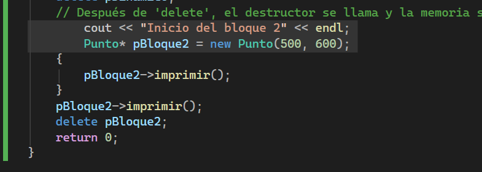

## Actividad 10

### Refexión

1. Explica el ciclo de vida de un objeto en el stack versus uno en el heap.

Los objetos en el stack tienen un ciclo de vida limitado al ámbito donde fueron creados. Cuando una función termina, los objetos locales en el stack son destruidos automáticamente. En cambio, los objetos en el heap persisten hasta que se eliminan explícitamente con `delete`. Los objetos del heap son creados dinámicamente y requieren una gestión manual de memoria, mientras que los del stack son gestionados automáticamente por el compilador.

### Modificación de código

1. ¿Compila? ¿Por qué ocurre esto?

No, no compila, ya que `pBloque2` es un puntero que no se encuentra definido correctamente en el código. Para que el código compile, es necesario declarar e inicializar `pBloque2` antes de usarlo.

2. Modifica el programa para declarar pBloque2 por fuera del bloque, pero inicializarlo dentro del bloque. ¿Qué ocurre? ¿Por qué?

Si se declara `pBloque2` fuera del bloque pero se inicializa dentro del bloque, el programa compilará correctamente. Sin embargo, si se intenta acceder a `pBloque2` fuera del bloque donde fue inicializado, se producirá un error de acceso a memoria, ya que `pBloque2` no tendrá un valor válido fuera de su ámbito de inicialización. Esto ocurre porque la memoria asignada a `pBloque2` solo es válida dentro del bloque donde fue inicializada.

### Segunda parte

1. ¿Por qué el objeto `pBloque` se destruye al salir del bloque y `pBloque2` no? Recuerda de nuevo, `pBloque2` es un objeto o es una referencia a un objeto?

El objeto `pBloque` se destruye al salir del bloque porque es un objeto local que se encuentra en el stack, y su ciclo de vida está limitado al ámbito del bloque donde fue declarado. En cambio, `pBloque2` es un puntero a un objeto que se encuentra en el heap. El objeto al que apunta `pBloque2` no se destruye automáticamente al salir del bloque, ya que su ciclo de vida depende de la gestión manual de memoria. `pBloque2` es una referencia a un objeto en el heap, y mientras no se elimine explícitamente con `delete`, el objeto permanecerá en memoria incluso después de salir del bloque.

2. ¿En qué parte de la memoria se almacena `pBloque2`?

`pBloque2` se almacena en el stack, ya que es un puntero local declarado dentro de la función.

3. ¿En qué parte de la memoria se almacena el objeto al que apunta `pBloque2`?

El objeto al que apunta `pBloque2` se almacena en el heap, ya que fue creado dinámicamente con `new`.
