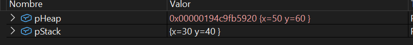

## Actividad 7

1. Explicación de la diferencia entre objetos creados en el stack y en el heap.
   - Los objetos creados e el Stack son aquellos que funcionan dentro de una misma función y se elimina automaticamente al falir de esta. Pero los objetos creados en el Heap son aquellos que se crean con la palabra reservada `new` y permanecen en memoria.

2. `pStack` ¿Es un objeto o una referencia a un objeto?
    - `pStack` es un objeto creado en el stack, es decir, es una variable local a la función en la que se encuentra y se elimina automáticamente al salir de esa función.

3. `pHeap` ¿Es un objeto o una referencia a un objeto? Si es una referencia, ¿A qué objeto hace referencia?
    - pHeap es una referencia a un objeto creado en el heap. Hace referencia a un objeto de la clase `Punto` que se creó con la palabra reservada `new` en la función `main`.

4. Observa en Memory1 (Debug->Windows->Memory->Memory1) el contenido de la dirección de memoria de `pHeap`, recuerda escribir en la entrada de texto de Memory1 la dirección de memoria de `&pHeap` y presionar Enter. Compara el contenido de memoria con el contenido de `pHeap` en la pestaña de Locals (Debug->Windows->Locals). ¿Qué observas? ¿Qué significa esto?

    

    - En las pestaña de `pHeap` en Locals se muesta la dirección del objeto creado y lo que contine, pero en `pStak` se muestra el valor de la variable local, que es la dirección del objeto creado en el heap. Esto significa que `pHeap` es una referencia a un objeto creado en el heap, mientras que `pStack` es un objeto creado en el stack. 