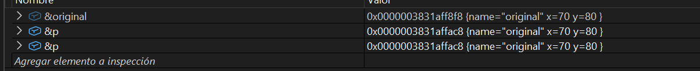
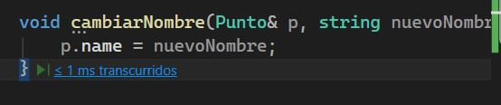
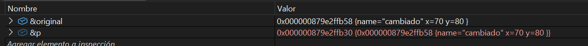

## Actividad 8

1. ¿Qué ocurre después de llamar a la función cambiarNombre? ¿Por qué aparece el mensaje Destructor: Punto cambiado(70, 80) destruido.?
    Después de llamar a la función cambiarNombre, se crea un nuevo objeto Punto con los valores (70, 80) y se asigna a la variable p. El mensaje Destructor: Punto cambiado(70, 80) destruido.aparece porque el objeto original Punto cambiado(10, 20) es destruido al salir del ámbito de la función cambiarNombre. Esto se debe a que el objeto original es creado dentro de la función cambiarNombre y no tiene existencia fuera de esa función, por lo que se libera automáticamente cuando la función termina su ejecución.

2. Por qué original sigue existiendo luego de llamar cambiarNombre?
    Porque el objeto original fu creado globalmente. Este no se ve afectado por la función cambiarNombre ya que esta función solo modifica el objeto local creado dentro de su ámbito. El objeto original permanece intacto y sigue existiendo después de llamar a la función.

3. ¿En qué parte del mapa de memoria se encuentra original y en qué parte se encuentra p? ¿Son el mismo objeto? (recuerda usar siempre el depurador para responder estas preguntas).

     No son el mismo objeto 
        

### Modificar la función

1. ¿Qué ocurre ahora? ¿Por qué?

    Ahora al llamar la funcióm cambiarNombre, se combierten en un mismo objeto porque al ejecutar 
    

2. Se cambia la función`cambairNombre` y el `main`

````.c++
void cambiarNombre(Punto* p, string nuevoNombre) {  
		p->name = nuevoNombre;
		}
int main() {    // Objeto original    
		Punto original("original",70, 80);    
		original.imprimir();
    cambiarNombre(&original, "cambiado");    
    original.imprimir();
    return 0;
    }
````

- ¿Qué ocurre ahora? ¿Por qué?

    Ahora al llamar la función cambiarNombre, se modifica el mismo objeto original porque se le pasa la dirección de memoria del objeto original a la función cambiarNombre. Al usar un puntero, la función puede acceder y modificar directamente el objeto original en lugar de crear una copia local. Por lo tanto, cualquier cambio realizado dentro de la función afectará al objeto original fuera de la función.


3. En este caso ¿Cuál es la diferencia entre pasar un objeto por valor, por referencia y por puntero?
    
    - Pasar por valor: Se crea una copia del objeto original. Cualquier modificación dentro de la función no afecta al objeto original.
    - Pasar por referencia: Se pasa una referencia al objeto original, permitiendo modificar el objeto original desde dentro de la función sin crear una copia.
    - Pasar por puntero: Se pasa la dirección de memoria del objeto original, permitiendo modificar el objeto original desde dentro de la función mediante el uso del puntero.
