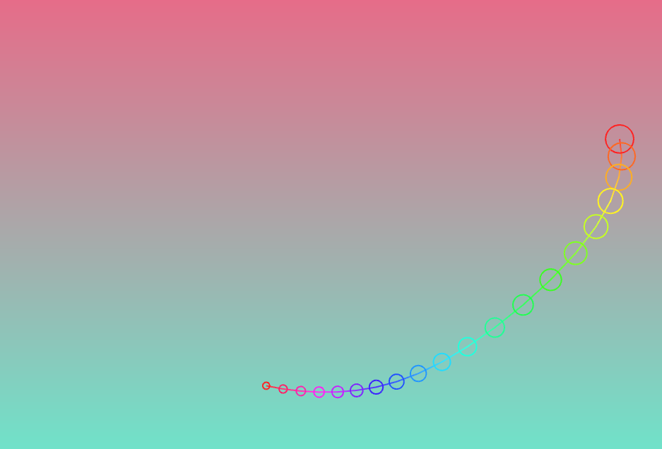

## Actividad 2


- Esta línea de código es parte de un algoritmo que se utiliza para actualizar la posición de los nodos de una serpiente en un juego. El algoritmo recorre cada nodo de la serpiente, comenzando desde la cabeza. 
``` .c++
Node* current = snake.head;
while (current != nullptr) {    
		current->position = glm::mix(glm::vec3(current->position, 0.0f), glm::vec3(target, 0.0f), interpolationFactor);    
		target = current->position;    
		current = current->next;
		}
```




- En esta parte de código se inicializa la serpiente con varios nodos en el centro de la pantalla. Se utiliza un bucle para agregar nodos a la serpiente, y cada nodo se posiciona ligeramente desplazado.

````.c++
void ofApp::setup() {
	backgroundHue = 0;
	// Inicializa la serpiente con varios nodos en el centro    
	for (int i = 0; i < 20; i++) {
		// Agrega nodos con posiciones ligeramente desplazadas para crear una forma inicial más interesante
		snake.push_back(glm::vec2(ofGetWidth() / 2, ofGetHeight() / 2));
	}
}
````
