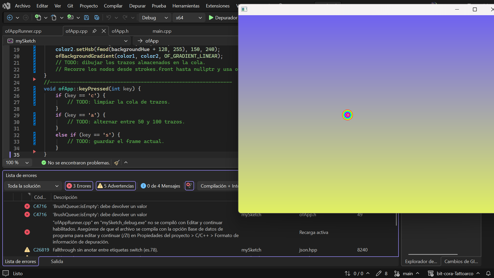
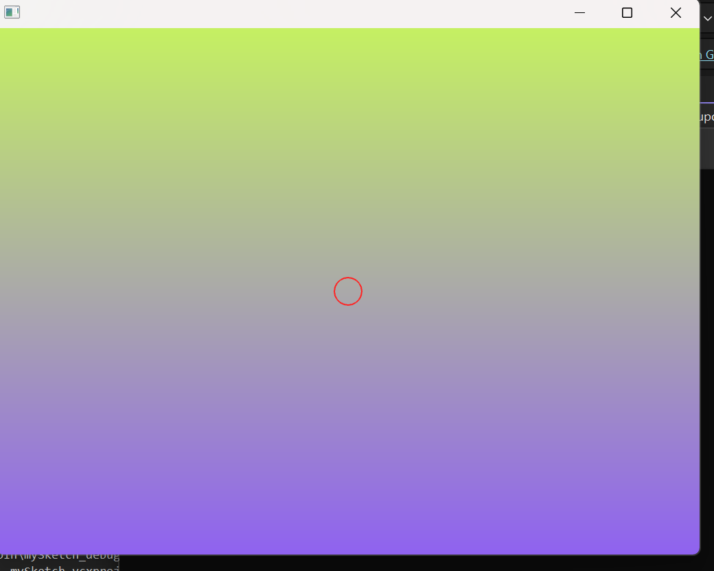

## Actividad 4

Copíe el código dado principalmente (con los faltantes), se ejecutó, pero solo salió una ventana indicando si se se decidia ejectar con error o sin error, se decidió ejecutar con error, mosntro otra ventana con la `snake` funcionando, pero con errores en el visual.




- El código que se muestra a continuación es parte de un algoritmo que se utiliza para actualizar la posición de los nodos de una serpiente en un juego. El algoritmo recorre cada nodo de la serpiente, comenzando desde la cabeza. 

``` .c++
void BrushQueue::enqueue(float x, float y, float radius, ofColor color, float opacity) {
	Node* newNode = new Node(ofGetWidth() / 2, ofGetHeight() / 2, 20.0, (250, 20), 2);
	// TODO: crear un nuevo nodo y agregarlo al final de la cola.    
	// Si la cola supera `maxSize`, eliminar el nodo más antiguo con `dequeue()`
	if (front == nullptr) {
		front = rear = newNode;
	}
	else {
		front->next = newNode;
		front = newNode;
	}size++;

	if (size >= maxSize) {
		dequeue();
	}
}
```
- En esta parte de código se inicializa la serpiente con varios nodos en el centro de la pantalla. Se utiliza un bucle para agregar nodos a la serpiente, y cada nodo se posiciona ligeramente desplazado.

````.c++   
void ofApp::setup() {    
		ofBackground(0);
		for (int i = 0; i < 20; i++) {
			strokes.enqueue(ofGetWidth()/ 2, ofGetHeight() / 2, 20, ofColor(250, 20), 2);
		}
}
````
- El código que se muestra a continuación es parte de un algoritmo que se utiliza para actualizar la posición de los nodos de una serpiente en un juego. El algoritmo recorre cada nodo de la serpiente, comenzando desde la cabeza. 

``` .c++
void ofApp::update() {    
		backgroundHue += 0.2;    
		if (backgroundHue > 255) 
				backgroundHue = 0;
    // TODO: agregar un nuevo trazo si el mouse está presionado.    
    // Usa strokes.enqueue(x, y, radius, color, opacity);

		if (ofGetMousePressed()) {
			strokes.enqueue(ofGetMouseX(), ofGetMouseY(), 20, ofColor(250, 20), 2);
		}
    }
```

- En este momento se ejecuta el programa, muestra la gradiente de fondo cambiando de color, pero no se muestra el trazo de la `snake` al mover el mouse. Aparece el primer círculo en el centro y funciona la función `clear()`



