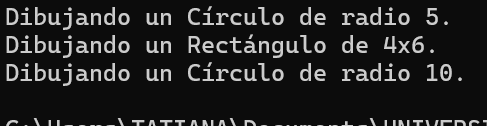

## Actividad 1 

### Saberes previos
1. ¿Qué es el encapsulamiento para ti? Describe una situación en la que te haya sido útil o donde hayas visto su importancia.

Consiste en hacer que no se pueda acceder a los datos de un objeto directamente, sino a través de métodos específicos.  

Me ha sido útil al crear el primer videojuego, ya que me permitió proteger los datos de los objetos del juego y evitar que se modificaran accidentalmente. Por ejemplo, al encapsular la información de un personaje, pude asegurarme de que su salud solo se modificara a través de métodos específicos, lo que evitó errores y mantuvo la integridad del juego.


2. ¿Qué es la herencia? ¿Por qué un programador decidiría usarla? Da un ejemplo simple.

La herencia es un prinicipio que permite crear una nueva clase y que esta herede atributos y métodos de una clase ya exixtente. Un programador decide utilizarls para reutilizar código y hacer que el programa de más fácil de mantener. 

3. ¿Qué es el polimorfismo? Describe con tus palabras qué significa que un código sea “polimórfico”.

Es la capacidad de un clase de responder a un llamado de una sub-clase de forma diferente al mismo método. Un código es plimorofo cuando se puede usar el mismo método para diferentes tipos de objetos, y cada objeto puede responder de manera diferente a ese método. 

## Parte 2: 
Al depurar el código dado en la cosolo se mostró la siguente salida 



**Encapsulamiento:**

- Señala una línea de código que sea un ejemplo claro de encapsulamiento y explica por qué lo es.

```.c#
private string nombre;
public double Radio { get; private set;}
public double Base { get; private set;}
public double Altura { get; private set;}
```

Estas líneas de código estan encapsuladas porque son privadas y solo se pueden acceder a traves de métodos especificos en la misma clase, protegiendo los datos.


- ¿Por qué crees que el campo nombre es private pero la propiedad Nombre es public? ¿Qué problema se evita con esto?

Se vuelve privado el campo `nombre` se privatisa para evitar que este sea modificado desde otros lugares del código. En cambio la propiedad `Nombre` es publica para poder acceder a su valor desde otras partes del código, evitando así, que el valor de `nombre` sea modificado directamente, lo que podría causar errores o inconsistencias en el programa.

**Herencia:**

- ¿Cómo se evidencia la herencia en la clase Circulo?

En la línea: 

```c#
public class Circulo : Figura
```

Se evidencia la herencia en la clase Circulo porque se indica que Circulo es una subclase de Figura, lo que significa que Circulo hereda los atributos y métodos de Figura.

- Un objeto de tipo Circulo, además de Radio, ¿Qué otros datos almacena en su interior gracias a la herencia?

Gracias a la herencia un objeto de tipo Circulo también almacena el campo `nombre` y la propiedad `Nombre` que se encuentran en la clase Figura, ya que Circulo hereda estos miembros de Figura.

**Polimorfismo:**

- Observa el bucle `foreach`. La variable `fig` es de tipo Figura, pero a veces contiene un Circulo y otras un Rectangulo. Cuando se llama a `fig.Dibujar()`, el programa ejecuta la versión correcta. En tu opinión, ¿Cómo crees que funciona esto “por debajo”? No necesitas saber la respuesta correcta, solo quiero que intentes razonar cómo podría ser.

```.c#
foreach (Figura fig in misFiguras)
{
    fig.Dibujar();
}
```

`misFiguras` es una lista de figuras y cada figura tiene su propia implementacion del metodo dibujar. Esta figuras se almacenan en `fig` y al llamar a `fig.Dibujar()`, el programa determina en tiempo de ejecución qué versión del método Dibujar() debe ejecutar, dependiendo del tipo real del objeto que `fig` está referenciando en ese momento. Todo esto esta almacenado dentro del `heap.

### Parte 3:

1. Memoria y herencia: cuando creas un objeto Rectangulo, este tiene Base, Altura y también Nombre. ¿Cómo te imaginas que se organizan esos tres datos en la memoria del computador para formar un solo objeto? 


2. El mecanismo del polimorfismo: pensemos de nuevo en la llamada fig.Dibujar(). El compilador solo sabe que fig es una Figura. ¿Cómo decide el programa, mientras se está ejecutando, si debe llamar al Dibujar del Circulo o al del Rectangulo? Lanza algunas ideas o hipótesis.

3. La barrera del encapsulamiento: ¿Cómo crees que el compilador logra que no puedas acceder a un miembro private desde fuera de la clase? ¿Es algo que se revisa cuando escribes el código, o es una protección que existe mientras el programa se ejecuta? ¿Por qué piensas eso?


## Actividad 2 — Análisis del caso de estudio: fuegos artificiales

### ¿Qué hace el programa?

El programa simula un **sistema de fuegos artificiales** usando una jerarquía de clases de partículas. La interacción es simple: clic para lanzar un cohete, barra espaciadora para lanzar 1000 a la vez.

### Jerarquía de clases

```
Particle  (abstracta)
├── RisingParticle          → el "cohete" que sube
└── ExplosionParticle       → base de las explosiones
    ├── CircularExplosion   → explota en círculo
    ├── RandomExplosion     → explota en rectángulos aleatorios
    └── StarExplosion       → explota en forma de estrella
```

### Explicación por clase

**`Particle`** es la clase base abstracta. Define la interfaz que deben cumplir todas las partículas mediante métodos virtuales puros:

```cpp
virtual void update(float dt) = 0;
virtual void draw() = 0;
virtual bool isDead() const = 0;
```

No puede instanciarse directamente. Obliga a las clases hijas a implementar esos métodos.

---

**`RisingParticle`** es el cohete. Nace en la parte inferior central de la pantalla con una velocidad hacia arriba. En cada frame:

- Actualiza su posición según la velocidad.
- Aplica desaceleración (simula gravedad: `velocity.y += 9.8f * dt * 8`).
- Cuando llega al 15% superior de la pantalla **o** se acaba su `lifetime`, marca `exploded = true`.
- Cuando `exploded == true`, `isDead()` y `shouldExplode()` devuelven `true`.


**`ExplosionParticle`** es la clase base para los tres tipos de explosión. Gestiona el **desvanecimiento gradual**: mapea el `age` al canal alpha del color, de modo que la partícula se va volviendo transparente hasta desaparecer.


**`CircularExplosion`**, **`RandomExplosion`** y **`StarExplosion`** heredan de `ExplosionParticle` y solo cambian:

- La dirección/velocidad inicial de cada partícula.
- La forma en que se dibujan (`draw()`): círculo, rectángulo o estrella de 5 rayos.

### Flujo principal en `ofApp::update()`

```
1. Actualizar todas las partículas (update).
2. Recorrer el vector al revés:
   a. Si shouldExplode() → generar 20-30 nuevas ExplosionParticles
      y hacer delete de la RisingParticle.
   b. Si isDead() → hacer delete de la partícula.
```

### Gestión de memoria

El vector `particles` guarda **punteros** (`Particle*`) a objetos creados con `new`. El destructor `~ofApp()` hace `delete` de cada uno para evitar fugas de memoria. Esto es necesario porque C++ no tiene recolector de basura automático.

---

## Actividad 3 — Objetos en memoria y vtable

### Hipótesis sobre `ofApp` en memoria

Antes de depurar, lo esperado es ver únicamente el vector `particles`, ya que es el único **dato miembro** declarado en `ofApp`. Los métodos no ocupan espacio en el objeto; están en el segmento de código. Si `ofApp` tiene métodos virtuales heredados de `ofBaseApp`, también debería aparecer un puntero `_vtable`.

### Sobre la `_vtable`

Cuando se observa un objeto `CircularExplosion` en el depurador, la estructura anidada es:

```
CircularExplosion
└── ExplosionParticle          (subobjeto de la clase base)
    └── Particle               (subobjeto de la clase base base)
        └── _vtable*           ← puntero a la tabla de funciones virtuales
```

La **vtable** es una tabla de punteros a funciones, una por cada método virtual. Cada clase concreta tiene su propia vtable con las direcciones de **sus** implementaciones.

### Comparación de vtables: `CircularExplosion` vs `StarExplosion`

| Método virtual | `CircularExplosion` vtable | `StarExplosion` vtable |
|---|---|---|
| `update()` | → `ExplosionParticle::update` | → `ExplosionParticle::update` |
| `draw()` | → `CircularExplosion::draw` | → `StarExplosion::draw` |
| `isDead()` | → `ExplosionParticle::isDead` | → `ExplosionParticle::isDead` |
| `shouldExplode()` | → `Particle::shouldExplode` | → `Particle::shouldExplode` |

**Conclusión:** los métodos que no se sobreescriben apuntan a la misma función en ambas tablas. El único que difiere es `draw()`.

### ¿Para qué sirve la vtable? → Polimorfismo

Cuando el programa ejecuta:

```cpp
particles[i]->draw();
```

El compilador **no sabe** en tiempo de compilación si `particles[i]` apunta a un `CircularExplosion`, un `RandomExplosion` o un `StarExplosion`. Solo sabe que es un `Particle*`.

En tiempo de **ejecución**, el procesador:

1. Toma el objeto apuntado.
2. Lee su `_vtable*` (primer campo del objeto).
3. En esa tabla, busca la entrada correspondiente a `draw()`.
4. Salta a esa dirección de función.

Así, cada objeto ejecuta **su propia versión** de `draw()` aunque la llamada se haga a través de un puntero de tipo `Particle*`. Esto es el **despacho dinámico** (*dynamic dispatch*).

---

## Actividad 4 — Encapsulamiento

### Experimento 1: modificadores de acceso

```c++
AccessControl ac;
ac.publicVar = 10;    
ac.protectedVar = 20;   
ac.privateVar = 30;     
```

El compilador bloquea el acceso a miembros `private` y `protected` desde fuera de la clase. El error ocurre en tiempo de compilación, no en ejecución.

```c++
int main() {    
		MyClass obj(42, 3.14f, 'A');    
		// Esta línea causará un error de compilación    
		std::cout << obj.secret1 << std::endl;
    obj.printMembers();  
    // Método público para mostrar los valores    
    return 0;
    }
```

El programa **no compila** debido a que `secret1` es un miembro `private` y no se puede acceder directamente desde `main()`.

### Experimento 2

```cpp
int* ptrInt = reinterpret_cast<int*>(&obj);
float* ptrFloat = reinterpret_cast<float*>(ptrInt + 1);
char* ptrChar = reinterpret_cast<char*>(ptrFloat + 1);

std::cout << *ptrInt << "\n";    // imprime secret1 = 42
std::cout << *ptrFloat << "\n";  // imprime secret2 = 3.14
std::cout << *ptrChar << "\n";   // imprime secret3 = 'A'
```

El programa compila y se ejecuta, imprimiendo los valores privados.

**Conclusión:** en tiempo de ejecución no existe ninguna barrera real. Los campos `private` son datos en memoria como cualquier otro. El encapsulamiento es una **restricción que el compilador hace cumplir**, no una protección de hardware ni de sistema operativo.

### ¿Qué es el encapsulamiento y por qué importa?

El encapsulamiento es el principio de **ocultar los detalles internos** de un objeto y exponer solo lo que es necesario a través de una interfaz pública controlada.

Su importancia radica en que:

- Evita que código externo modifique el estado interno de un objeto de formas no previstas.
- Permite cambiar la implementación interna sin romper el código que usa la clase.
- Hace el código más fácil de mantener, depurar y razonar.

La barrera del encapsulamiento es una **convención de diseño** que el
 compilador ayuda a cumplir, no una protección absoluta en tiempo de ejecución.


## Actividad 5 — Herencia en memoria
 
### Layout de CircularExplosion en memoria
 
La jerarquía es: `Particle` ← `ExplosionParticle` ← `CircularExplosion`
 
En C++, la herencia se implementa **incrustando el subobjeto de la clase base al inicio** del objeto hijo, de forma contigua:
 
```
Dirección base del objeto CircularExplosion:
┌──────────────────────────────────────┐
│  _vtable*         (de Particle)      │  ← 8 bytes (puntero)
├──────────────────────────────────────┤
│  position (glm::vec2)                │  ← de ExplosionParticle
│  velocity (glm::vec2)                │
│  color    (ofColor)                  │
│  age      (float)                    │
│  lifetime (float)                    │
│  size     (float)                    │
├──────────────────────────────────────┤
│  (CircularExplosion no agrega        │
│   campos propios de datos)           │
└──────────────────────────────────────┘
```
 
**Conclusión:** cuando se crea un objeto de una clase derivada, la memoria del objeto base queda **integrada físicamente** dentro del objeto derivado. No hay punteros entre niveles: es un bloque contiguo.
 
### ¿Cómo se implementa la herencia en C++?
 
La herencia en C++ se implementa en tiempo de compilación: el compilador calcula el tamaño total del objeto incluyendo todos los subobjetos de las clases base, los acomoda contiguamente en memoria (base primero, derivada después), y genera el código de los constructores en cadena. No hay "enlace" en tiempo de ejecución entre las partes del objeto: es un único bloque de memoria.
 
### Experimento: herencia múltiple
 
```cpp
class A {
public:
    int x;
    A() : x(1) {}
    virtual void hello() { std::cout << "A\n"; }
};
 
class B {
public:
    int y;
    B() : y(2) {}
    virtual void world() { std::cout << "B\n"; }
};
 
class C : public A, public B {
public:
    int z;
    C() : z(3) {}
};
 
int main() {
    C obj;
    // Layout en memoria de obj:
    // [ _vtable_A* | x | _vtable_B* | y | z ]
}
```
 
En el depurador se observa que el objeto `C` contiene **dos subobjetos**: primero el de `A` (con su propia vtable y su campo `x`), luego el de `B` (con su propia vtable y su campo `y`), y finalmente el campo propio `z`.
 
Esto es diferente a la herencia simple: con herencia múltiple puede haber **más de una vtable** en el mismo objeto, una por cada clase base que tenga métodos virtuales. Esto complica el layout y es una de las razones por las que C# no permite herencia múltiple de clases (solo de interfaces).
 


