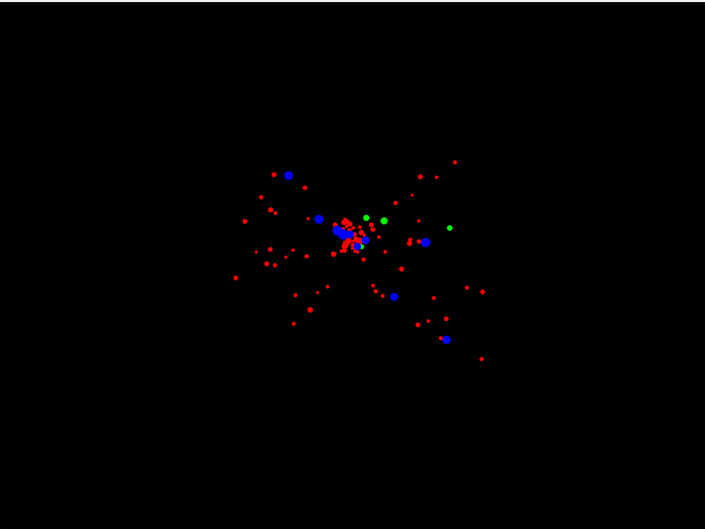
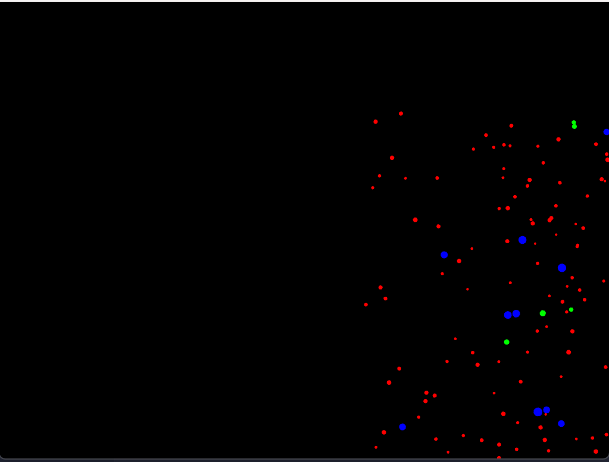
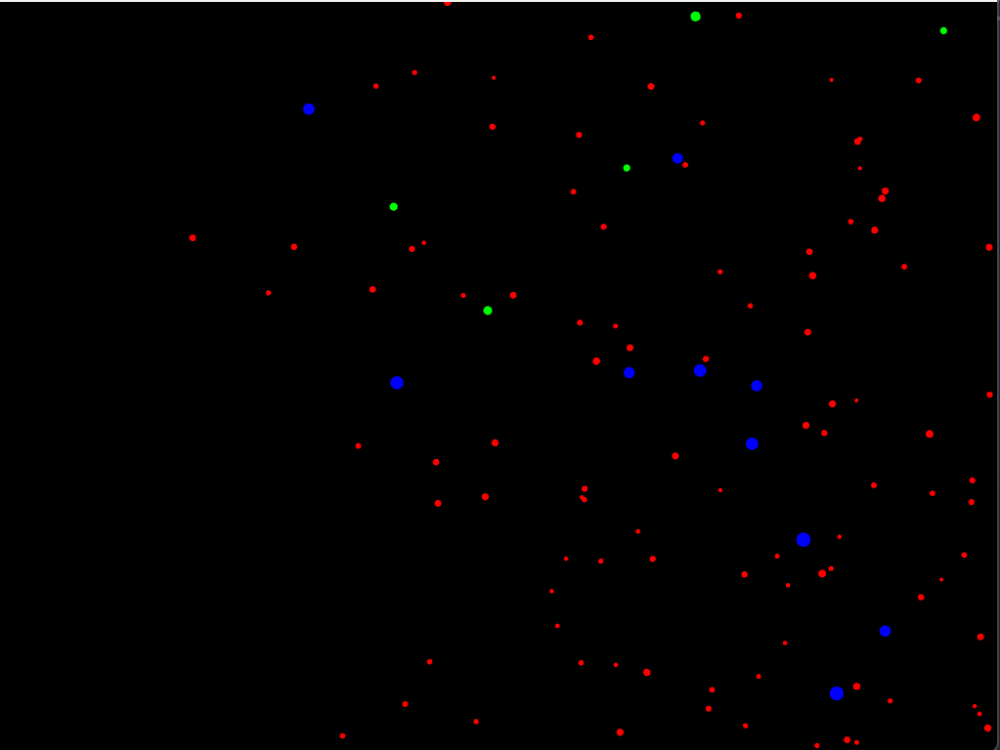
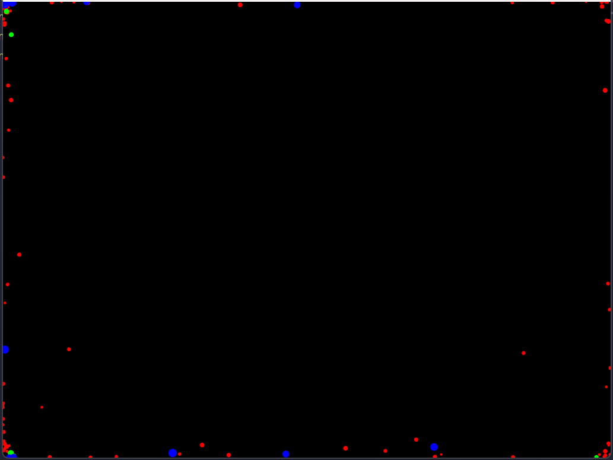

## Actividad 1

1. ¿Cómo puedes interactuar con la aplicación? Menciona específicamente las teclas y qué efecto parecen tener sobre las partículas.

**a** : La acción de esta tecla parece hacer que las partículas se agrupen o se unan entre sí.

**r** : Esta tecla hace que las partículas de separen y se dispersen hasta ocultarse de la pantalla.

**s** : Hace que que se queden etáticas en la posisción en la que se encuentran.

**n** : Esta tecla hace que las particulas se separen y se dispersen por la pantalla.

2. ¿Observas los diferentes tipos de “partículas”? ¿Se comportan todas igual inicialmente?

No, al iniciar la aplicación se obsevan particulas de tamaños diferentes y colores diferentes que se muevende forma distinta, algunas se mueven más rápido que otras y algunas parecen tener un movimiento más errático que otras.

3. Toma algunas capturas de pantalla de la aplicación en diferentes momentos (estado inicial, después de presionar ‘a’, ‘r’, ‘s’, ‘n’) y añádelas a tu bitácora.

**a** : 
**s** : 
**n** : 
**r** : 

4. ¿Qué crees que está pasando “detrás de cámaras” cuando presionas las teclas? Formula una hipótesis inicial sobre cómo la aplicación cambia el comportamiento de las partículas. 

Mi hipótesis es que cada tecla activa una función diferente en el código de la aplicación que modifica las propiedades de las partículas, como su velocidad, dirección o interacción entre ellas. Por ejemplo, la tecla 'a' podría activar una función que hace que las partículas se atraigan entre sí en la dirección del mouse, mientras que la tecla 'r' podría activar una función que las hace repelerse. La tecla 's' podría detener el movimiento de las partículas, y la tecla 'n' podría hacer que se dispersen aleatoriamente por la pantalla.

