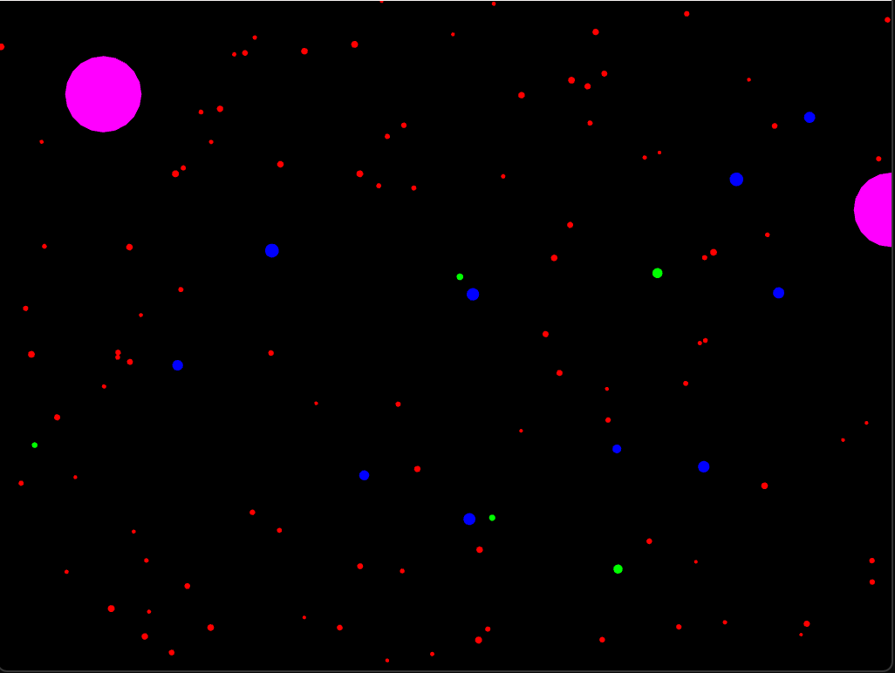

## Actividad 5


1. El código fuente completo de tu proyecto openFrameworks.





```c++
Particle* ParticleFactory::createParticle(const std::string& type) {
	Particle* particle = new Particle();
	if (type == "star") {	
		particle->size = ofRandom(2.0f, 4.0f);
		particle->color = ofColor(255, 0, 0);
	}
	else if (type == "shooting_star") {
		particle->size = ofRandom(3.0f, 6.0f);
		particle->color = ofColor(0, 255, 0);
		particle->velocity *= 3.0f;
	}
	else if (type == "planet") {
		particle->size = ofRandom(5.0f, 8.0f);
		particle->color = ofColor(0, 0, 255);
	} 
	else if (type == "black_hole") {
		particle->size = ofRandom(40.0f, 50.0f);
		particle->color = ofColor(255, 0, 255);
	}
	return particle;
}
``` 


```c++
void ofApp::setup() {
	ofBackground(0);
	particles.reserve(100 + 5 + 10);
	for (int i = 0; i < 100; ++i) {
		Particle* p = ParticleFactory::createParticle("star");
		particles.push_back(p);	
		addObserver(p);
	}
	for (int i = 0; i < 5; ++i) {
		Particle* p = ParticleFactory::createParticle("shooting_star");
		particles.push_back(p);
		addObserver(p);
	}
	for (int i = 0; i < 10; ++i) {
		Particle* p = ParticleFactory::createParticle("planet");
		particles.push_back(p);
		addObserver(p);
	}
	for (int i = 0; i < 2; ++i) {
		Particle* p = ParticleFactory::createParticle("black_hole");
		particles.push_back(p);
		addObserver(p);
	}
}
```

2. Explica cómo usaste el patrón Factory para esta nueva partícula.

En el `ofApp.cpp` en *ParticleFactory::createParticle* creé una nueva partícla, la cual llamé **black_hole**, para luego en el *setup()* agregar esta nueva partícula y que cuando se recorran los for esta este creada y se muestre coreectamente.


3. Describe cómo implementaste el patrón Observer para esta nueva partícula.

Al *Particle* heredar de *Observer* se utilizan elementos que la clase padre `(observer)` que ayudan a la creaciion de una nueva particula, omitiendo escribir nuevo código por particula, lo que se hace es asignar valores a las variables heredadas y se notifica que su estado ha enmbiado dependiendo de lo que esta llamndo. 


4. Explica cómo aplicaste el patrón State a esta nueva partícula.
No se agrega en la creación pero si en la implementación.