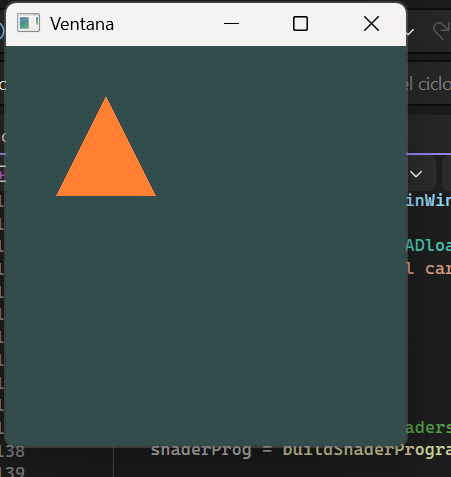
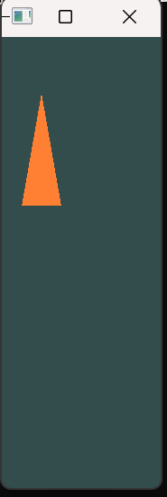
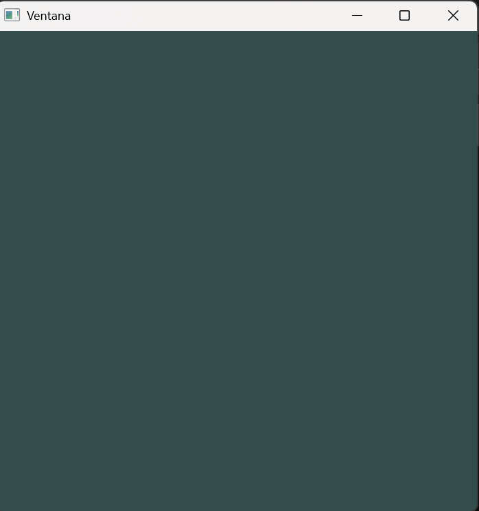

## Actividad 3

### Primera reflexión 

* Qué tal si ensayas. Prueba con esta línea

`// 9) Configura el viewportglViewport(0, 0, bufferWidth, bufferHeight);`¿Qué pasa si?

`glViewport(0, bufferHeight/2, bufferWidth/2, bufferHeight/2);`

Cambia los valores de bufferWidth y bufferHeight: divide por 2, por 4, multiplica por 2, por 4, etc. ¿Qué pasa? ¿Qué observas? ¿Qué crees que está pasando? 



Al viewport definir que parte el framebuffer va a dibujar hace que las "coordenadas" cambien, originalmente se daba el canva completo y dibujaba en la mitad de este, pero al dividir por la mitad en en X y Y hace que dibuje en una sección especifica del canva. 

### Segunda reflexión 

¿Cómo lo haces? Realiza un resumen de lo que has aprendido hasta ahora, haciendo un diagrama conceptual o un mapa mental. Experimentando. ¿Cómo? Haciendo la pregunta mágica: ¿Qué pasaría si? ¿Qué pasaría si cambio el tamaño de la ventana? ¿Qué pasaría si cambio el tamaño del viewport?


GLFW ──────────────► crea ventana + contexto OpenGL
                             │
                    contexto OpenGL (estado gráfico)
                             │
                    ┌────────┴────────┐
                 shaders           framebuffer
               (vertex + frag)   (memoria donde GPU pinta)
                    │                  │
               VAO / VBO           viewport
           (datos de vértices)  (región visible del framebuffer)
                    │
                  GPU ◄──── OpenGL le da instrucciones


1. 

```c++
// Tamaño de las ventanas
const unsigned int SCR_WIDTH = 100;
const unsigned int SCR_HEIGHT = 500;

glViewport(0, bufferHeight / 2, bufferWidth / 2, bufferHeight / 2);
```



2. 

```c++
const unsigned int SCR_WIDTH = 700;
const unsigned int SCR_HEIGHT = 700;

	glViewport(0, bufferHeight / 5, bufferWidth / 5, 0);

```




3. ¿Qué pasa si cambias el primer parámetro de glDrawArrays a GL_LINES? 

¿Qué pasa si lo cambias a GL_POINTS? 

¿Qué pasa si cambias el tercer parámetro a 2? ¿Qué pasa si lo cambias a 4?


### Tercera reflexión

1. ¿Qué es el contexto OpenGL?

Es el espacio de trabajo de OpenGL: una estructura interna que almacena todo el estado gráfico (shaders activos, buffers, texturas, matrices, versión usada). Sin él, las funciones de OpenGL no tienen dónde operar. Es como el taller del artista: sin taller, el artista no puede trabajar.

2. ¿Cuál es el rol de GLFW y qué ventaja tiene?

GLFW actúa como arquitecto del entorno: crea la ventana, el contexto OpenGL y maneja eventos (teclado, mouse, redimensionado). Su ventaja principal es la portabilidad: abstrae las diferencias entre Windows, Linux y macOS. Sin GLFW tendrías que escribir código distinto para cada sistema operativo.

3. ¿Por qué OpenGL necesita un contexto?

Porque OpenGL no es un programa independiente, sino una API que se comunica con la GPU. Necesita un espacio donde guardar su estado (qué shaders están activos, qué buffers existen, qué versión usar). Volviendo a la analogía: el artista (GPU) no puede crear sin un taller equipado (contexto) donde estén todas sus herramientas.

4. ¿Qué es el framebuffer y a qué te recuerda?

El framebuffer es una región de memoria de video donde la GPU deposita los píxeles de cada cuadro antes de mostrarlos en pantalla. Recuerda a los pixelmaps o bitmaps trabajados en unidades anteriores del curso: una grilla de píxeles en memoria que representa una imagen. La diferencia es que aquí la GPU escribe directamente en ella usando los shaders.

5. ¿Qué relación hay entre el viewport y el framebuffer?

El framebuffer es toda la memoria disponible para dibujar. El viewport es la región dentro de ese framebuffer que OpenGL usará efectivamente. Si el viewport es más pequeño que el framebuffer, la escena se dibuja solo en esa zona. Si no coincide con el tamaño real, la imagen aparece estirada o recortada.

6. ¿Qué rol juegan los drivers de la GPU y la GPU misma?

OpenGL → da instrucciones en un lenguaje estándar.
Driver de la GPU → traduce esas instrucciones al lenguaje específico de tu tarjeta gráfica (cada fabricante tiene su propia arquitectura).
GPU → ejecuta los shaders en paralelo y escribe los píxeles resultantes en el framebuffer.

Sin el driver, OpenGL no podría hablar con la GPU. Es el traductor indispensable entre la API y el hardware.

7. ¿Por qué activar VSync? ¿Qué pasa sin él?
VSync sincroniza el intercambio de buffers con la tasa de refresco del monitor. Sin él:

- **Imagen estática:** probablemente no notes diferencia visual, pero la GPU trabaja innecesariamente a máxima velocidad (miles de FPS), consumiendo energía sin beneficio.

- **Imagen dinámica:** aparece el tearing, un artefacto donde se ve parte del frame anterior y parte del nuevo al mismo tiempo, porque el swap ocurre en mitad de un refresco del monitor.


8. ¿Qué es OpenGL Legacy vs OpenGL Moderno?

Legacy (Inmediato)Moderno (Core Profile)Forma de dibujarglBegin / glEndShaders + VAO + VBOPipelineFijo (no programable)Completamente programableRendimientoMenor (CPU hace más trabajo)Mayor (GPU hace el trabajo)FlexibilidadLimitadaTotal
OpenGL moderno obliga a usar shaders y buffers explícitos, lo que da más control y mejor rendimiento.