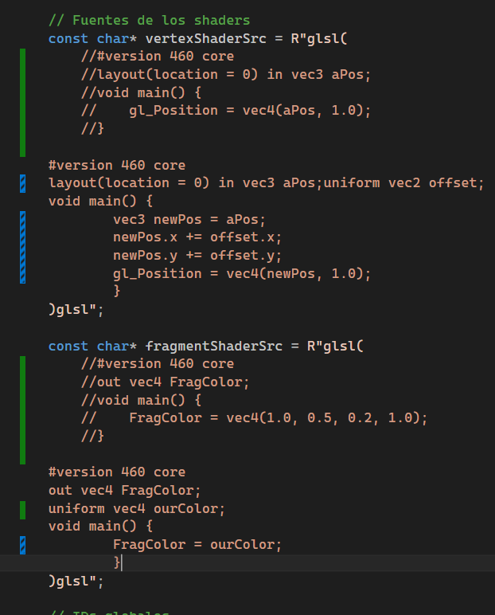
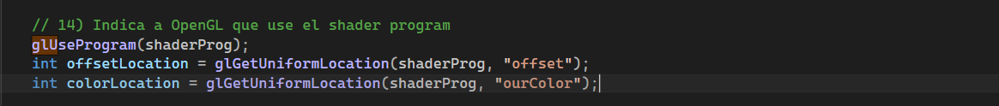
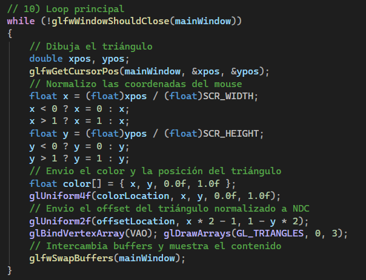
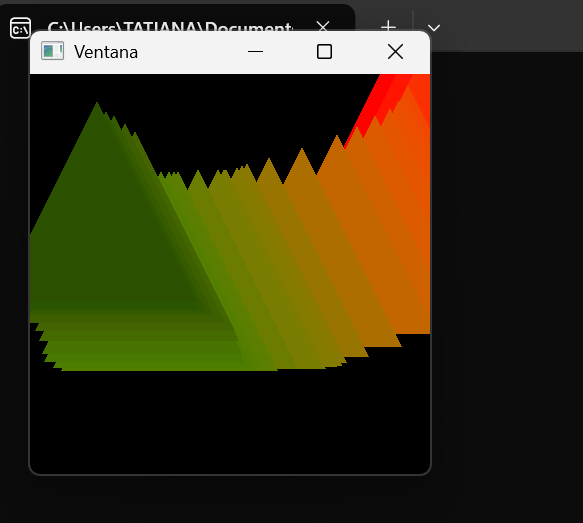

## Actividad 5


### Parte 1

1. Modifica el código del triángulo para que sea interactivo.

* Código que se modificó: 


* Agregué el siguent código



* También agregué el siguiente código para normalizar las coordenadas del mouse



2. Incluye una captura de pantalla del triángulo interactivo funcionando en tu máquina.



3. Explica el proceso de normalización de las coordenadas del mouse y cómo se relaciona con el sistema de coordenadas de OpenGL.

* El mouse reporta posiciones en píxeles

```c++
float x = (float)xpos / (float)SCR_WIDTH;
x < 0 ? x = 0 : x;
x > 1 ? x = 1 : x;
float y = (float)ypos / (float)SCR_HEIGHT;
y < 0 ? y = 0 : y;
y > 1 ? y = 1 : y;
```

Esto normaliza las coordenadas del mouse a un rango de 0 a 1, donde (0,0) representa la esquina inferior izquierda de la ventana y (1,1) representa la esquina superior derecha. Este proceso es necesario porque OpenGL utiliza un sistema de coordenadas normalizado para renderizar objetos en la pantalla. Al normalizar las coordenadas del mouse, podemos mapear fácilmente las posiciones del mouse a las coordenadas de OpenGL, lo que nos permite interactuar con los objetos renderizados de manera más intuitiva.


4. Explica el proceso de normalización a coordenadas de dispositivo (NDC) y cómo se relaciona con el sistema de coordenadas de OpenGL

Después de que las coordenadas del mundo se transforman a coordenadas de cámara, se aplican varias transformaciones para convertirlas a coordenadas de clip. Estas coordenadas de clip se dividen por la componente w para obtener las coordenadas NDC, que están en el rango de -1 a 1 en todas las dimensiones (x, y, z).